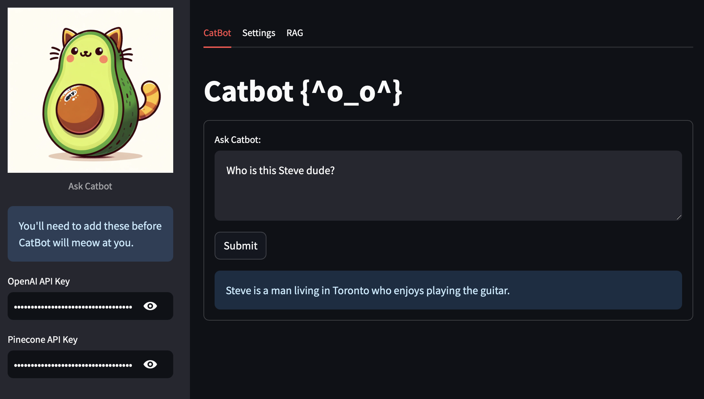
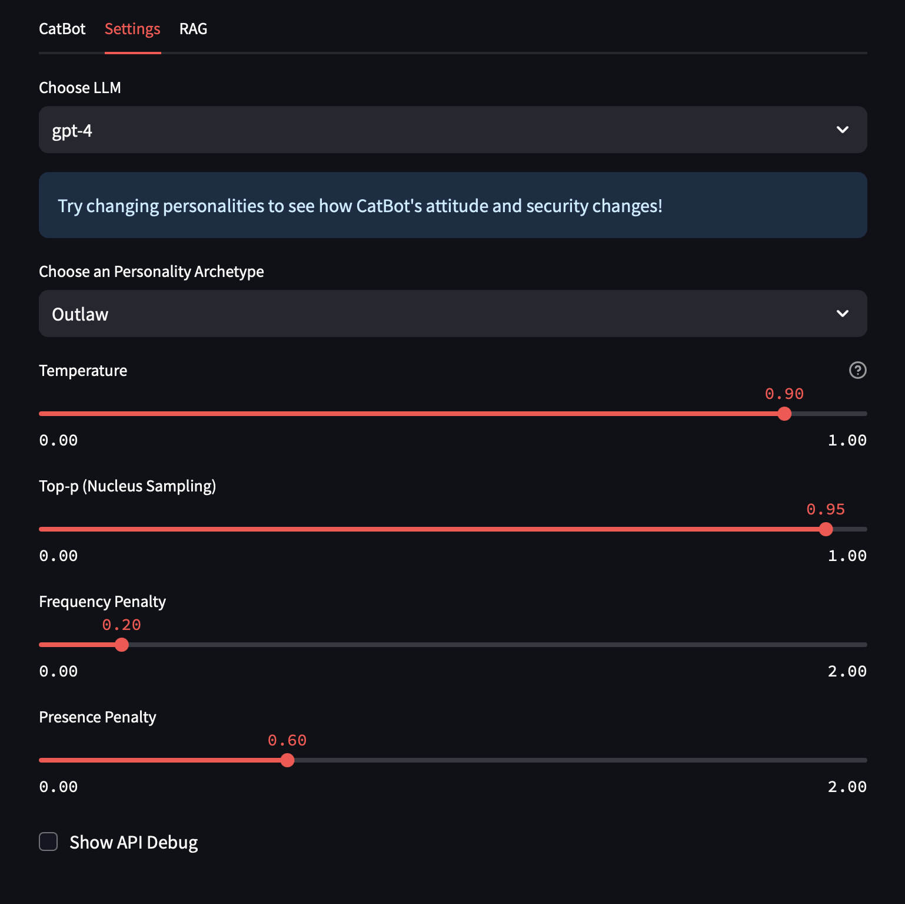
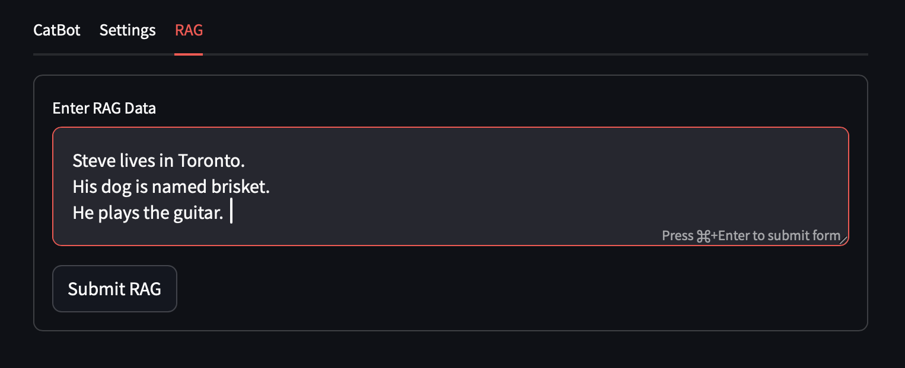

# Catbot

Catbot is an AI-powered C(h)atbot built with LangChain, OpenAI, and Pinecone. The bot leverages embeddings, machine learning models, and a vector database to provide efficient and relevant responses based on input queries.  It exists as a demo environment to experiement with the basic architecture of RAG based chatbots and prompting.

## Features
- **Environment Configurations**: Set up defaults via environment variables.
- **Streamlit Interface**: A user-friendly UI built with Streamlit.

- **Chat Models**: Utilizes `ChatOpenAI` from LangChain for intelligent responses.
- **Configurable Models**: Dropdown settings to try different mainstream models.
- **Configurable Archetypes**: Dropdown settings set CatBot to different personalities.

- **Vector Database Integration**: Leverages Pinecone for managing and querying RAG embeddings.
- **Works with pre-existing Pinecone databases**: Change the 'index' to access pre-existing RAG data.


## Installation

1. **Clone the repository**:
    ```bash
    git clone <repository_url>
    cd catbot
    ```

2. **Install the required packages**:
    ```bash
    pip install -r requirements.txt
    ```

3. **Set up environment variables**:
   - `PINECONEAPI`: Your Pinecone API key.
   - `OPENAIKEY`: Your OpenAI API key.
   - `LLM`: (Optional) Set the language model type (default is `gpt-3.5-turbo`).

4. **Run the application**:
    ```bash
    streamlit run CatBot.py
    ```

## Usage

Once the app is running, navigate to `http://localhost:8501` to access the chatbot interface. If this is your first time using CatBot, go the the RAG tab and add some experimental data and click Submit RAG to create your private vector database.  Now input your queries and receive contextually relevant responses. See the Settings tabs to change models and personalities!

## Pinecone Configuration Options

- `BATCH_SIZE`: Controls the number of vectors processed in each batch.
- `VECTOR_LIMIT`: Sets a limit on the number of vectors for Pinecone storage.

## Project Structure

- `CatBot.py`: The main application script.
- `requirements.txt`: Lists all dependencies for the project.

## Dependencies

This project requires the following libraries:

- `streamlit`
- `langchain`
- `openai`
- `sentence_transformers`
- `pinecone-client`
- `numpy`
- `tqdm`

## License

This project is licensed under the MIT License. See the `LICENSE` file for more details.
